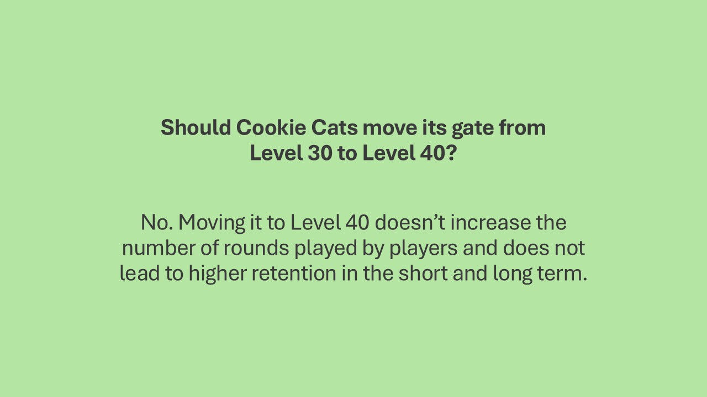
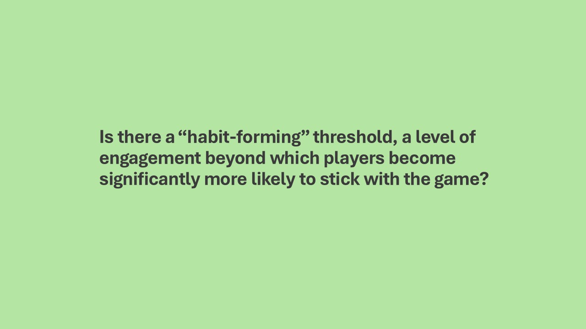
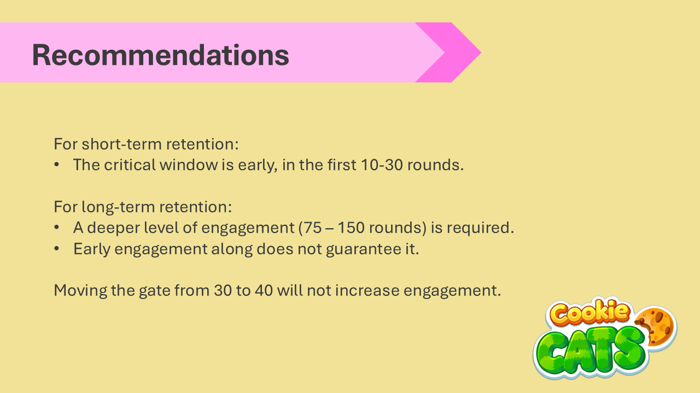

# The Cookie Cats Experiment

## Project Overview
This project analyzes A/B experiment data for the mobile game, Cookie Cats. Cookie Cats currently pauses players at level 30 ("a gate") before they can keep playing. I tested moving that gate to level 40 instead, to see if it changes how players behave.

I found that moving the gate doesn't meaningfully change how much players play. It doesn't help with retention either. In fact, keeping the gate at level 30 is slightly better. There also appears to be a "habit forming" zone and it happens early in the game. Players who reach roughly 20-40 rounds are more likely to come back the next day. Longer-term loyalty (returning a week later) takes more time. Players generally need to reach 100+ rounds before the same leveling off happens.

## Tech Stack
The following libraries and tools were used:
- Pandas
- Numpy
- Plotly

## A Closer Look
### Context

### Methods and Data
This analysis uses the Cookie Cats A/B test dataset, in which players were randomly assigned to one of two conditions: the first progression gate at level 30 (control; N = 44,700) or at level 40 (treatment; N = 45,489). Three outcome variables are examined: (1) total rounds played, (2) Day 1 retention, and (3) Day 7 retention. Day 1 and Day 7 retention indicate whether a player returned to the game at least once within 1 day and 7 days of installation, respectively, offering a view into short- and long-term engagement.

In our analysis for the first outcome variable, sum of rounds played, I utilized the Mann-Whitney U test for two reasons. 

- First, the number of rounds played is heavily right-skewed. Most players play relative few rounds, but a small number of highly engaged players play an extreme number. In the data, we see a player with roughly 49,000 rounds while the median is around 16-17. This creates a distribution that is nowhere close to normal.
- Second, t-tests are highly sensitive to outliers. The one player with 49,000 rounds would pull the average up and inflate the variance, potentially masking or distorting the real group difference. Mann-Whitney test on the other hand, tests whether one group tends to have systematically higher or lower values than the other, working directly on ranks rather than raw values. This is a more appropriate test given the shape of our data.

In the analysis for our second and third outcome variable, day 1 and day 7 retention, I utilized a two-proportion z-test. There are several reasons as to why this was the case. 
- First, day 1 and day 7 retention are variables with binary outcome. Each player either returned (1) or didn't (0) within the given window.
- I also have have a large sample and the sampling distribution approximates a normal distribution. This is the key assumption in the z-test. 

### Analysis and Results
#### Sum of Rounds Played

* Click the chart above to explore the interactive version. *
#### Day 1 Retention

#### Day 7 Retention

### Question: Should Cookie Cats move its gate from Level 30 to Level 40?

### Question: Is there a "habit-forming" threshold, a level of engagement beyond which players become significantly more likely to stick with the game?

To explore whether there's an engagement level associated with stronger retention, players were grouped into buckets based on total rounds played (e.g., 0, 1-4, 5-9...). Within each bucket, the percentage of players who returned on Day 1 and Day 7 was calculated. This allows us to see how retention likelihood changes as engagement increases. 

* Click the chart above to explore the interactive version. *

The Day 1 retention curve (gold) rises steeply through the early buckets, then flattens out. It climbed from just 2% (players with 0 rounds) to 56% by the 20-29 rounds bucket, before leveling off and gaining only marginally beyond that point.

The Day 7 retention curve (teal) behaves different. It starts lower and climbs more gradually, but keeps rising well past where Day 1 has already flattened. It continues to gain meaningfully all the way through the 100-199 rounds range. 

This pattern offers a visual answer to the habit-forming question. Short-term "stickiness" (Day 1) appears to lock in relatively early, somewhere in the first 20-40 rounds. After that point, playing more does not meaningfully change whether someone comes back the next day. Long-term retention (Day 7) on the other hand, keeps building with continued engagement well beyond that point, suggesting that habit formation over a longer horizon requires deeper, sustained play rather than just an early engagement spike. 

#### Recommendations to the Product Team

