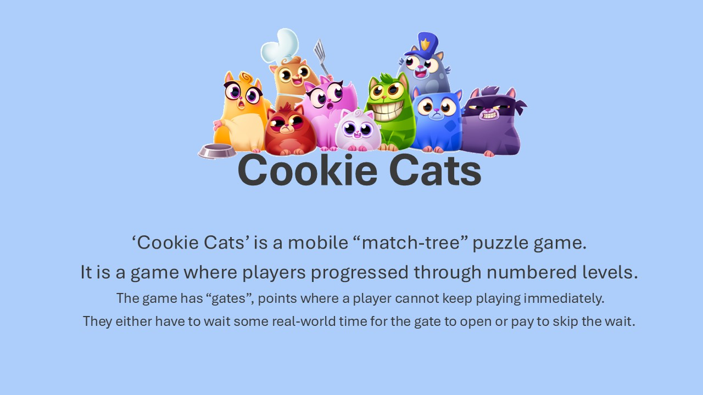
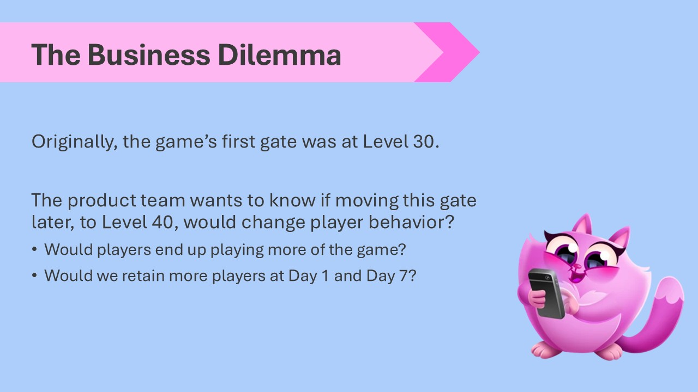
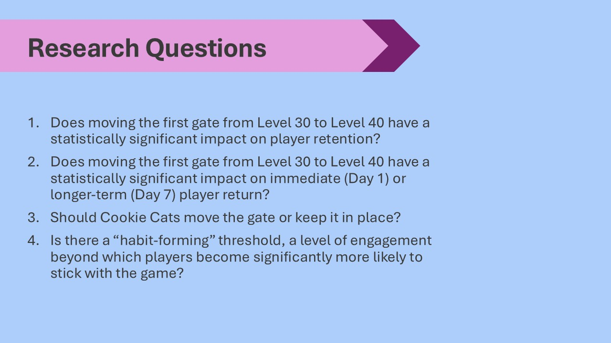
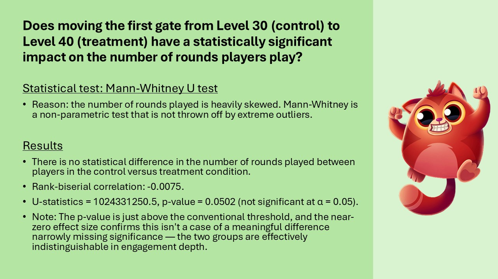
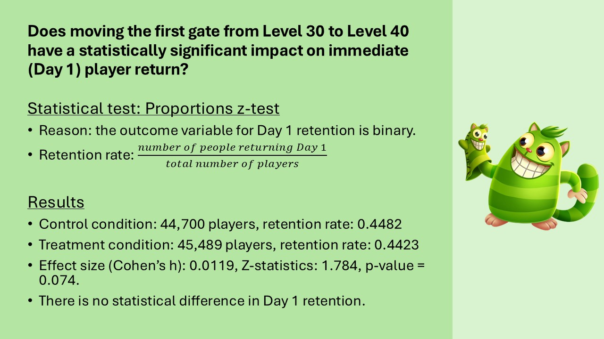
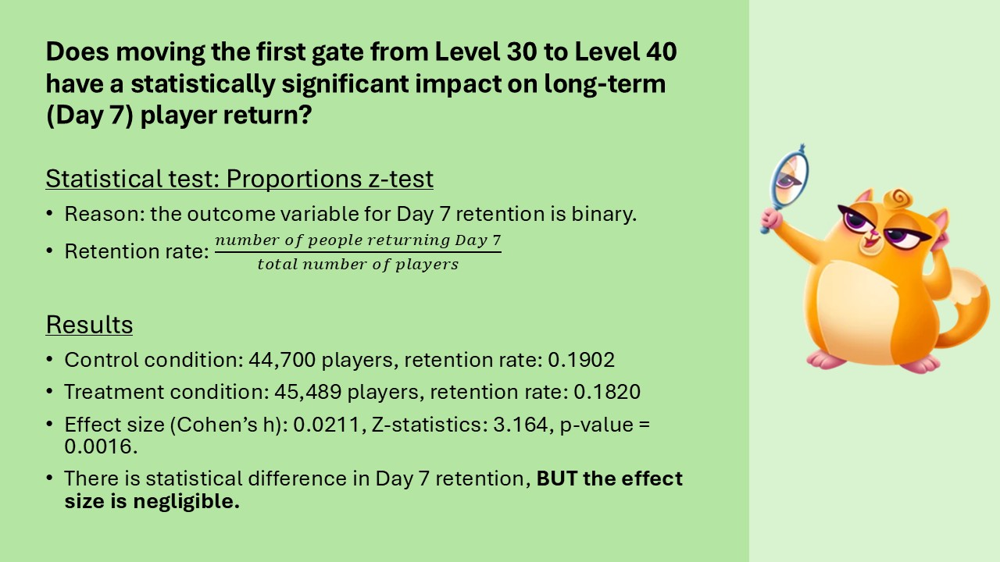

# The Cookie Cats Experiment

## Project Overview
This project analyzes A/B experiment data for the mobile game, Cookie Cats.

## Features

## Tech Stack
The following libraries and tools were used:
- Pandas
- Numpy
- Plotly

## A Closer Look
### Context

### Methods and Data
This analysis uses the Cookie Cats A/B test dataset, in which players were randomly assigned to one of two conditions: the first progression gate at level 30 (control; N = 44,700) or at level 40 (treatment; N = 45,489). Three outcome variables are examined: (1) total rounds played, (2) Day 1 retention, and (3) Day 7 retention. Day 1 and Day 7 retention indicate whether a player returned to the game at least once within 1 day and 7 days of installation, respectively, offering a view into short- and long-term engagement.

In our analysis for the first outcome variable, sum of rounds played, I utilized the Mann-Whitney U test for two reasons. 

- First, the number of rounds played is heavily right-skewed. Most players play relative few rounds, but a small number of highly engaged players play an extreme number. In the data, we see a player with roughly 49,000 rounds while the median is around 16-17. This creates a distribution that is nowhere close to normal.
- Second, t-tests are highly sensitive to outliers. The one player with 49,000 rounds would pull the average up and inflate the variance, potentially masking or distorting the real group difference. Mann-Whitney test on the other hand, tests whether one group tends to have systematically higher or lower values than the other, working directly on ranks rather than raw values. This is a more appropriate test given the shape of our data.

In the analysis for our second and third outcome variable, day 1 and day 7 retention, I utilized a two-proportion z-test. There are several reasons as to why this was the case. 
- First, day 1 and day 7 retention are variables with binary outcome. Each player either returned (1) or didn't (0) within the given window.
- I also have have a large sample and the sampling distribution approximates a normal distribution. This is the key assumption in the z-test. 

### Analysis and Results
#### Sum of Rounds Played

#### Day 1 Retention

#### Day 7 Retention

